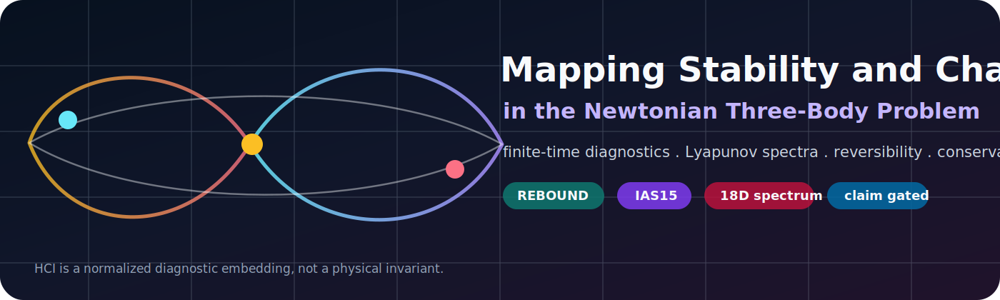
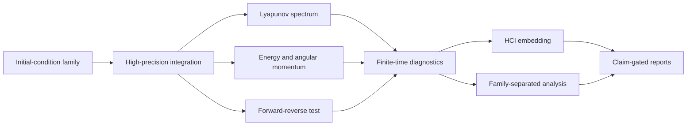

<p align="center">
  
</p>

<p align="center">
  <a href="https://www.python.org/"></a>
  <a href="https://github.com/Arihant-Bharanidharan/Three-Body-Chaos-Simulator-and-Analyzer/actions"></a>
  <a href="LICENSE"></a>
  
  
</p>

# 🌌 Mapping Stability and Chaos in the Three-Body Problem

**A finite-time computational diagnostics framework for heterogeneous Newtonian three-body dynamics.**

This repository studies stability and chaos indicators in the classical three-body problem using high-precision numerical integration, ensemble sampling, Lyapunov-spectrum diagnostics, reversibility tests, conservation-law checks, and claim-gated reporting.

The goal is not to announce a new law of gravity or a universal stability boundary. The goal is sharper and more useful: build a reproducible research pipeline that turns raw trajectory behavior into conservative, quantitative, finite-time diagnostics.

## ⚡ At A Glance

| Component | What it does |
| --- | --- |
| `3BS-Simulator.py` | One-command simulator entry point |
| `three_body_chaos_modules/` | Modular simulator implementation loaded automatically |
| `analyzer.py` | Analyzer for existing outputs, tables, figures, and reports |
| REBOUND IAS15 | Preferred adaptive high-accuracy integrator |
| Full Lyapunov spectrum | Estimates all 18 finite-time exponents, not just one number |
| HCI | Normalized diagnostic embedding, not a physical invariant |
| Figure-eight orbit | Benchmark/control only, not the production ensemble |

## 🧭 Why This Exists

The three-body problem is simple to write down and hard to understand. Three masses, Newtonian gravity, and no general closed-form solution. Tiny changes in initial conditions can produce dramatically different finite-time behavior, but numerical artifacts can also masquerade as chaos.

This project is built around that distinction. It combines several independent diagnostics so that chaos-like behavior is not inferred from a single plot, a single exponent, or a single famous orbit.

## 🔬 Scientific Scope

This framework is designed for:

- finite-time chaos diagnostics
- heterogeneous three-body ensemble studies
- numerical validation of conservation laws
- Lyapunov-spectrum and reversibility analysis
- cautious computational nonlinear dynamics reporting

This framework does not claim:

- a global stability map of the three-body problem
- a universal chaos law
- a new solution to the three-body problem
- new gravitational physics
- exact regime boundaries from HCI thresholds

## 🪐 Dynamical Families

Production runs use family-based sampling instead of repeated perturbations of one canonical orbit.

| Family | Role |
| --- | --- |
| `random_bounded` | Default production family for bounded randomized triples |
| `hierarchical_triple` | Inner binary plus distant tertiary |
| `binary_scattering` | Bound binary with incoming intruder |
| `unequal_mass` | Symmetry-broken mass-ratio systems |
| `near_collision` | Close-encounter stress tests |
| `figure8` | Benchmark/control for numerical validation only |

## 🧪 Diagnostic Stack



## 🚀 Core Features

- REBOUND IAS15 support for adaptive high-accuracy integration
- SciPy fallback and cross-validation pathways
- full 18D phase-space Lyapunov-spectrum diagnostics
- Benettin/QR orthonormalization workflow
- forward-reverse reversibility tests
- energy and angular-momentum conservation diagnostics
- family-separated ensemble analysis
- large-run guard for ensemble sizes above 10,000
- claim-gated paper/report generation
- Markdown, LaTeX-ready, JSON, CSV, and figure outputs

## 🧩 Hamiltonian Chaos Index

The Hamiltonian Chaos Index, or HCI, is a normalized diagnostic embedding built from:

- largest finite-time Lyapunov exponent
- reversibility error
- energy drift
- angular-momentum drift

HCI is useful for organizing runs inside an ensemble. It is not a Hamiltonian invariant, not a law of motion, and not an exact physical phase label.

## 🛠️ Quick Start

### Install

```powershell
python -m pip install -r requirements.txt
```

### Inspect commands

```powershell
python 3BS-Simulator.py --help
python analyzer.py --help
```

### Run a tiny validation sample

```powershell
python 3BS-Simulator.py --quick --no-plots --ic-mode random_bounded --ensemble-size 10
```

### Run a larger production-style ensemble

```powershell
python 3BS-Simulator.py --backend auto --ensemble-size 25000 --confirm-large-run --ic-mode random_bounded
```

### Analyze existing outputs without rerunning simulations

```powershell
python analyzer.py --input outputs --output analysis_outputs --mode quick
```

## 📦 Outputs

Typical runs can produce:

- trajectory and diagnostic plots
- full Lyapunov-spectrum summaries
- largest-exponent estimates
- energy-drift reports
- angular-momentum drift reports
- reversibility-error summaries
- family comparison tables
- HCI and exploratory clustering summaries
- JSON and CSV analysis artifacts
- Markdown and LaTeX-ready paper assets

## 🧷 Reproducibility And Guardrails

- deterministic seeds are supported
- run configuration metadata is recorded
- source hashes are recorded where available
- large ensembles require explicit confirmation
- figure-eight is reserved for benchmark/control use
- finite-time estimates should be read with convergence diagnostics
- reports are claim-gated to avoid overstatement

## 🗂️ Project Layout

```text
.
|-- 3BS-Simulator.py          # simulator and diagnostics engine
|-- three_body_chaos_modules/ # ordered implementation modules
|   |-- 00_prelude_config.py
|   |-- 01_initial_conditions.py
|   |-- 02_physics_integration.py
|   |-- 03_lyapunov_validation.py
|   |-- 04_ensemble.py
|   |-- 05_diagnostics.py
|   |-- 06_plotting_reporting.py
|   `-- 07_cli_main.py
|-- analyzer.py               # analysis and report-generation engine
|-- assets/banner.svg         # repository visual identity
|-- requirements.txt          # Python dependencies
|-- CITATION.cff              # citation metadata
|-- LICENSE                   # PolyForm Noncommercial License
`-- NOTICE                    # attribution and redistribution notice
```

`3BS-Simulator.py` intentionally stays as the public command. It loads the smaller implementation modules automatically, so old run habits still work while the codebase is easier to inspect and maintain.

## 🧱 Modular Architecture

The simulator is split by scientific role:

- configuration and constants
- initial-condition generation
- physical equations and integration
- Lyapunov and convergence validation
- ensemble diagnostics
- conservation, reversibility, and HCI summaries
- plotting, reports, and CLI orchestration

This is a source-organization change only. It does not change the equations of motion or reinterpret previous results.

## 🗺️ Roadmap

- broader convergence benchmark suite
- stronger cross-integrator replay validation
- physically meaningful parameter-projection figures
- automated manuscript tables and figures
- optional GPU acceleration paths for ensemble diagnostics
- documented examples from small reproducible benchmark runs

## 🏷️ Keywords

`three-body-problem` `chaos-theory` `computational-physics` `dynamical-systems` `n-body` `numerical-simulation` `lyapunov-exponents` `hamiltonian-systems`

## 📚 Citation

If you use this software or analysis framework, please cite the repository metadata in `CITATION.cff`.

## 📜 License

Copyright (c) 2026 Arihant Bharanidharan. All Rights Reserved.

This project is licensed under the PolyForm Noncommercial License 1.0.0.

You may use, study and share this project only for noncommercial purposes under the terms of the LICENSE file. Commercial use requires prior written permission.

Redistribution must preserve copyright notices, license terms, attribution, and the `NOTICE` file.

Contact: Arihantbharani@outlook.com
