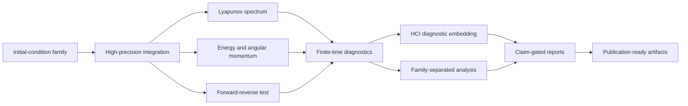

<p align="center">
  
</p>

<p align="center">
  <a href="https://www.python.org/"></a>
  <a href="https://github.com/Arihant-Bharanidharan/Three-Body-Chaos-Simulator-and-Analyzer/actions"></a>
  <a href="LICENSE"></a>
  
  
  
</p>

# Mapping Stability and Chaos in the Three-Body Problem

**A finite-time computational diagnostics framework for heterogeneous Newtonian three-body dynamics.**

This repository contains a modular simulator and a paper-grade analyzer for studying finite-time stability and chaos indicators in the classical three-body problem. It combines heterogeneous ensemble sampling, Lyapunov-spectrum diagnostics, conservation-law checks, reversibility tests, HCI summaries, exploratory feature-space clustering, anomaly triage, and claim-gated reporting.

The project does not claim a new law of gravity, a universal stability boundary, an exact regime classifier, or a solution to the three-body problem. It is a reproducible computational physics framework for conservative finite-time diagnostics.

## At A Glance

| Component | Role |
| --- | --- |
| `3BS-Simulator.py` | Public one-command simulator entry point |
| `three_body_chaos_modules/` | Modular simulator implementation loaded automatically |
| `analyzer.py` | Analysis, report generation, claim gates, and optional exploratory ML |
| REBOUND IAS15 | Preferred adaptive high-accuracy N-body integrator |
| Full Lyapunov spectrum | Estimates all 18 finite-time exponents |
| HCI | Normalized diagnostic embedding, not a physical invariant |
| Figure-eight orbit | Benchmark/control only, not the production ensemble |

## Scientific Scope

This framework is designed for:

- finite-time chaos diagnostics
- heterogeneous three-body ensemble studies
- numerical validation of conservation laws
- Lyapunov-spectrum and reversibility analysis
- family-separated computational nonlinear dynamics reporting
- conservative exploratory structure analysis from existing outputs

This framework does not support claims of:

- global stability maps of the three-body problem
- universal chaos laws
- exact physical phase boundaries from HCI or ML clusters
- new gravitational physics
- ML accuracy without external ground-truth labels

## Dynamical Families

Production runs use family-based sampling instead of repeated perturbations of a single canonical orbit.

| Family | Role |
| --- | --- |
| `random_bounded` | Default production family for bounded randomized triples |
| `hierarchical_triple` | Inner binary plus distant tertiary |
| `binary_scattering` | Bound binary with incoming intruder |
| `unequal_mass` | Symmetry-broken mass-ratio systems |
| `near_collision` | Close-encounter stress tests |
| `figure8` | Benchmark/control for numerical validation only |

## Diagnostic Stack



## Core Features

- REBOUND IAS15 support for adaptive high-accuracy integration
- SciPy fallback and cross-validation pathways
- full 18D phase-space Lyapunov-spectrum diagnostics
- Benettin/QR orthonormalization workflow
- forward-reverse reversibility tests
- energy and angular-momentum conservation diagnostics
- family-separated ensemble analysis
- large-run guard for ensemble sizes above 10,000
- HCI computed as a diagnostic embedding only
- Markdown, LaTeX-ready, JSON, CSV, SQLite, and figure outputs
- claim-gated report generation to block overstatement

## Analyzer: Claim-Gated ML And Anomaly Triage

`analyzer.py` works only from existing outputs. It does not run simulations and does not modify raw physics data.

The optional ML subsystem is designed for exploratory feature-space structure analysis, not supervised prediction. It uses fixed seeds, writes reproducibility metadata, and routes every ML-supported statement through conservative claim gates.

### What the ML analyzer does

- expands physics-derived features such as `largest_lyapunov`, `hci`, energy drift, angular-momentum drift, reversibility error, spectrum-pairing residuals, QR diagnostics, basin metrics, family labels, and ensemble summary fields
- prefers HDBSCAN when available
- falls back to OPTICS or KMeans when available
- falls back again to deterministic NumPy KMeans/PCA/silhouette/ARI if optional ML packages are absent
- computes silhouette and DBCV where available
- bootstraps cluster stability using adjusted Rand index
- compares exploratory clusters against lambda-only labels without treating either as ground truth
- flags anomaly candidates using IsolationForest and LocalOutlierFactor when available, with deterministic fallback anomaly scoring otherwise
- writes ML results into the evidence-strength matrix, final claim gate, traceability table, and supreme analysis report

### ML guardrails

ML output may support wording like:

> exploratory regime clustering supports finite-time feature-space structure where quality gates pass

ML output does not support wording like:

> ML proves the true regimes of the three-body problem

Quality gates require:

- silhouette score at least `0.4`
- bootstrap mean adjusted Rand index at least `0.7`
- at least two non-noise clusters
- no claim of higher accuracy without external ground-truth labels

### ML artifacts

When enabled, the analyzer can generate:

- `json/ml_analysis_summary.json`
- `json/ml_anomaly_summary.json`
- `data/ml_cluster_assignments.csv`
- `data/ml_feature_importance.csv`
- `data/ml_embedding.csv`
- `data/ml_anomaly_cases.csv`
- `markdown/ml_cluster_analysis.md`
- `markdown/ml_anomaly_report.md`
- `figures/ml_cluster_embedding.png`
- `figures/ml_anomaly_heatmap.png`
- `figures/ml_feature_importance.png`

## Installation

Required runtime:

```powershell
python -m pip install -r requirements.txt
```

Optional analyzer extras:

```powershell
python -m pip install scikit-learn hdbscan umap-learn
```

The optional extras are not required. If they are missing, `analyzer.py` falls back to deterministic NumPy/SciPy-compatible analysis where possible.

## Quick Start

Inspect commands:

```powershell
python 3BS-Simulator.py --help
python analyzer.py --help
```

Run a tiny validation sample:

```powershell
python 3BS-Simulator.py --quick --no-plots --ic-mode random_bounded --ensemble-size 10
```

Run a larger production-style ensemble:

```powershell
python 3BS-Simulator.py --backend auto --ensemble-size 25000 --confirm-large-run --ic-mode random_bounded
```

Analyze existing outputs without rerunning simulations:

```powershell
python analyzer.py --input outputs --output analysis_outputs --mode quick
```

Run the exploratory ML/anomaly analyzer on existing outputs:

```powershell
python analyzer.py --input outputs --output analysis_outputs_ml --mode ml
```

Run full analysis and enable the ML layer:

```powershell
python analyzer.py --input outputs --output analysis_outputs_full --mode full --enable-ml
```

## Outputs

Typical simulator/analyzer runs can produce:

- trajectory and diagnostic plots
- full Lyapunov-spectrum summaries
- largest-exponent estimates
- energy-drift reports
- angular-momentum drift reports
- reversibility-error summaries
- family comparison tables
- HCI and exploratory clustering summaries
- anomaly triage reports
- claim-gate JSON and Markdown
- evidence traceability tables
- Markdown and LaTeX-ready paper assets

## Reproducibility And Safety

- deterministic seeds are supported
- run configuration metadata is recorded
- source hashes are recorded where available
- large ensembles require explicit confirmation
- figure-eight is reserved for benchmark/control use
- finite-time estimates should be read with convergence diagnostics
- analyzer ML uses fixed seeds and writes manifest-style metadata
- claim gates block unsupported language and overclaims

## Project Layout

```text
.
|-- 3BS-Simulator.py          # simulator and diagnostics engine
|-- three_body_chaos_modules/ # ordered implementation modules
|   |-- 00_prelude_config.py
|   |-- 01_initial_conditions.py
|   |-- 02_physics_integration.py
|   |-- 03_lyapunov_validation.py
|   |-- 04_ensemble.py
|   |-- 05_diagnostics.py
|   |-- 06_plotting_reporting.py
|   `-- 07_cli_main.py
|-- analyzer.py               # analysis, ML triage, and report-generation engine
|-- assets/banner.svg         # repository visual identity
|-- requirements.txt          # required Python dependencies
|-- CITATION.cff              # citation metadata
|-- LICENSE                   # PolyForm Noncommercial License
`-- NOTICE                    # attribution and redistribution notice
```

`3BS-Simulator.py` intentionally stays as the public command. It loads the smaller implementation modules automatically, so old run habits still work while the codebase remains easier to inspect and maintain.

## Modular Architecture

The simulator is split by scientific role:

- configuration and constants
- initial-condition generation
- physical equations and integration
- Lyapunov and convergence validation
- ensemble diagnostics
- conservation, reversibility, and HCI summaries
- plotting, reports, and CLI orchestration

This is a source-organization change only. It does not change the equations of motion or reinterpret previous results.

## Roadmap

- broader convergence benchmark suite
- stronger cross-integrator replay validation
- physically meaningful parameter-projection figures
- automated manuscript tables and figures
- optional GPU acceleration paths for ensemble diagnostics
- documented examples from small reproducible benchmark runs

## Keywords

`three-body-problem` `chaos-theory` `computational-physics` `dynamical-systems` `n-body` `numerical-simulation` `lyapunov-exponents` `hamiltonian-systems`

## Citation

If you use this software or analysis framework, please cite the repository metadata in `CITATION.cff`.

## License

Copyright (c) 2026 Arihant Bharanidharan. All Rights Reserved.

This project is licensed under the PolyForm Noncommercial License 1.0.0.

You may use, study, and share this project only for noncommercial purposes under the terms of the LICENSE file. Commercial use requires prior written permission.

Redistribution must preserve copyright notices, license terms, attribution, and the `NOTICE` file.

Contact: Arihantbharani@outlook.com
